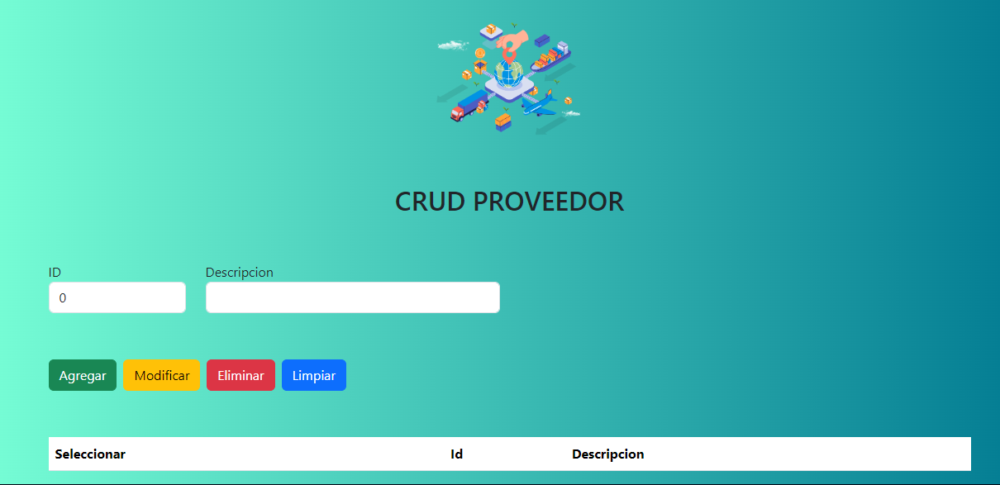
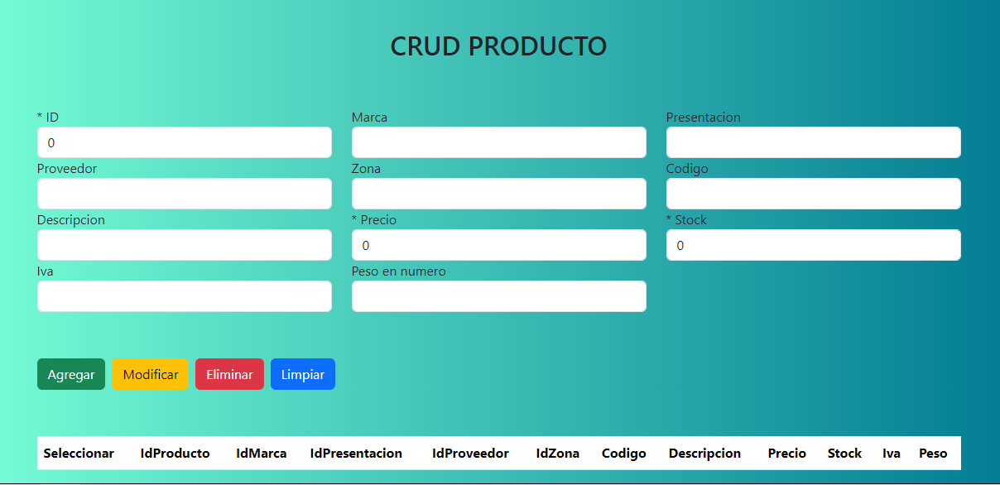
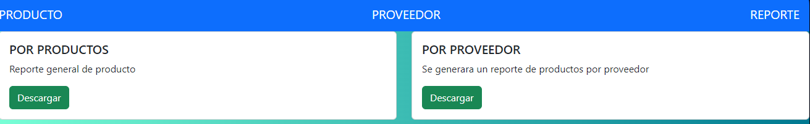

# MANUAL DE USUARIO
## TiendaX
## En nuestra aplicacion tenemos las siguientes opciones.
* PROVEEDOR
* PRODUCTO
* REPORTE

## Cada una de las siguientes opciones tiene un objetivo en especifico.

## PROVEEDOR:
### En el proveedor tenemos los siguiente campos:
* ID
* Proveedor
  
### El campo ID nos pide un valor numerico y el campo Proveedor de quien nos brinda el servicio. Ademas poseemos los siguientes botones como:
* Agregar
* Modificar
* Eliminar
* Seleccionar
  
## Agregar: nos agregara un nuevo proveedor.
## Modificar: podemos colocar un nuevo proveedor
## Eliminar:  nos eliminar el proveedor de la bases de datos. Y el parte inferior se muestra la lista de proveedores que poseemos.

## PRODUCTO:
### En el proveedor tenemos los siguiente campos:
* ID
* Marca
* Presentacion
* Proveedor
* Zona
* Codigo
* Descripcion
* Precio
* Stock
* Iva
* Peso
  
### Estos campos nos piden valores numericos,cadenas y doubles. Tambien el producto viene acompañado de los siguientes botones.
* Agregar
* Modificar
* Eliminar
* Seleccionar
  
## Agregar: nos agregara un nuevo producto.
## Modificar: podemos cambiar el nombre o descripcion del producto actual por otra.
## Eliminar:  nos eliminar el producto de la bases de datos. Y el parte inferior se muestra la lista de producto que poseemos.

## REPORTE:
### Tenemos dos cards con sus respectivos botones genera los siguientes repotes en pdf.
* Por productos
* Por Proveedor
  
### Al darle click al boton descargar descargara el reporte con nuestro productos y proveedores.

